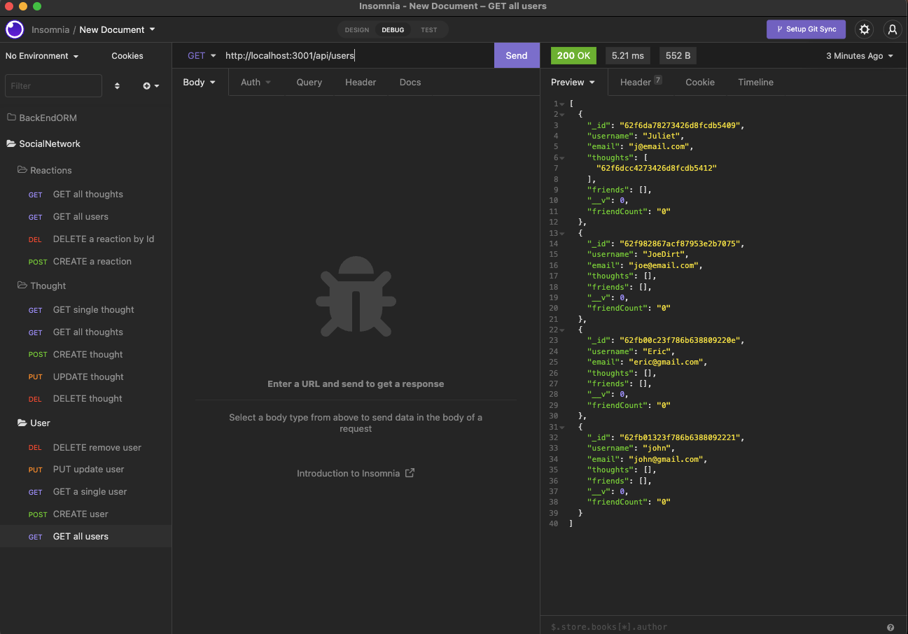

# SocialNetworkAPI

# Description:

This is an application for an API for a social network web application where users can share their thoughts, react to friends’ thoughts, and create a friend list.

# Link for video
https://drive.google.com/file/d/1O2wDOqOHz2dxdEyTMAqYDHAo6cEWTZm4/view

# Technology:

Javascript
Node.js
Express.js
MongoDB
Mongoose

# Screenshot
 